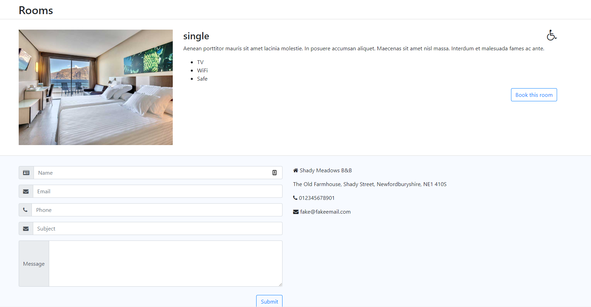

<h2>New Classrooms QA Assesment</h2>
<h3>Tools used:</h3>
<ul>
    <li>Playwright</li>
    <li>Javascript</li>
</ul>

Tests run on: Chrome, Firefox, Safari & Edge

Description of the automation is at the bottom

 
===================================
 
<h3>In order to run these tests do the following:</h3>
<ol>
    <li>Fork this repo.</li>
    <li>Open the folder -> In a terminal type 'npm install' (all the dependencies should be now installed).</li>
    <li>Type 'npx playwright test' in the terminal to run all the test suites.</li>
</ol>
====================================
<h3>Automation Scripts:</h3>
<h4>1. What was tested?</h4>

The 'Booking single room' E2E test script covers the stories below:

<ul>
    <li>User Story 1: As a customer, I see room options on the application home page</li>
    <li>User Story 2: As a customer, I can use the website on the desktop browser of my choosing</li>
    <li>User Story 3: As a customer, when I select the "Book this Room" button/CTA, I want the system to load the “availability calendar” and “contact information form</li>
    <li>User Story 4: As a customer, I want to select the dates of my intended stay in the calendar</li>
    <li>User Story 5: Contact Info Form Functionality</li>
    <li>User Story 6: Selecting the 'Book' CTA produces a 'booking successful' pop-up</li>
</ul>

The 'Multiple bookings and date confirmations' E2E test script covers the story below:

The 'Failed booking' E2E test script covers:

<ul>
    <li>Tests error handling for the contact form</li>
    <li>User Story 8: As a customer, I can only make a booking with dates that are available</li>
</ul>

<h3>Bugs found:</h3>
<ul>
    <li>User Story 1 is inconsistent. Sometimes I see two available rooms and sometimes I see one. This is a problem since I can't create
    multiple bookings due to not being able to select multiple rooms.
    Image of the bug is below.
    </li>
    
     
    <li>User Story 3 behavior do not match with the requirements. The calendar does not default to the next month. It opens to the current date and month.
    </li>
</ul>
